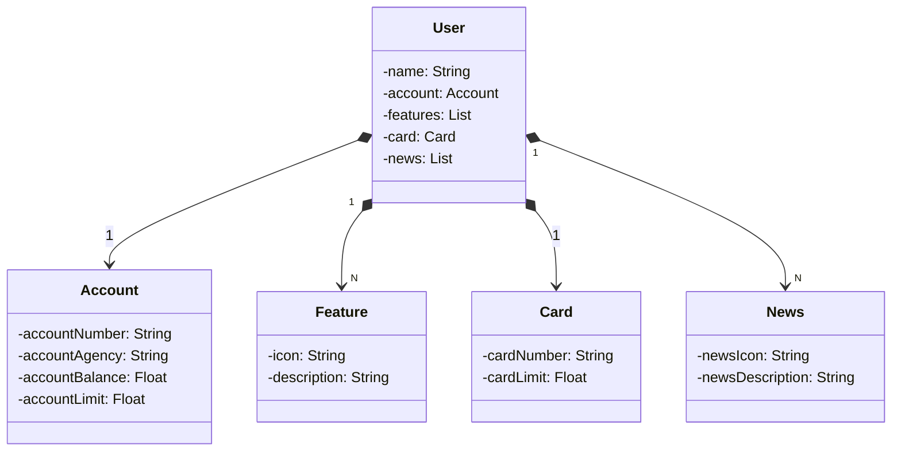

# Projeto Bootcamp Santander - Gerenciamento de Usuários Bancários

Este é um projeto desenvolvido como parte do "Bootcamp Backend Java Santander 2023" em colaboração com a DIO (Digital Innovation One). O objetivo deste projeto é demonstrar um sistema de gerenciamento de usuários bancários usando Spring Boot e JPA (Java Persistence API).

## Diagrama de Classes 

## Funcionalidades

O projeto oferece uma estrutura básica com as seguintes funcionalidades:

1. **Criação de Usuários (POST):** Você pode criar um novo usuário com informações como nome, conta e cartão associados. O sistema verifica a existência de uma conta com o mesmo número antes de criar o usuário.

2. **Consulta de Usuários por ID (GET):** Você pode recuperar informações de um usuário com base em seu ID.

3. **Operações de CRUD (a serem implementadas):** O projeto será expandido no futuro para incluir todas as operações CRUD (Create, Read, Update, Delete) para um gerenciamento completo de usuários bancários.

## Documentação da API

A documentação da API está disponível via Swagger, permitindo que você explore e consuma os endpoints diretamente:

[Documentação Swagger](https://bootcamp-santander-api-restful-production.up.railway.app/swagger-ui/index.html)

## Pré-requisitos

Antes de executar este projeto, certifique-se de atender aos seguintes pré-requisitos:

1. **Java Development Kit (JDK)**: Instale o JDK 17 ou uma versão compatível em seu sistema.

2. **Gradle**: O projeto utiliza o Gradle como sistema de automação de compilação e gerenciamento de dependências. O Gradle será instalado automaticamente ao importar o projeto em seu ambiente de desenvolvimento.

3. **Banco de Dados**: O projeto utiliza um banco de dados embutido H2 para desenvolvimento e teste. No entanto, você pode configurar um banco de dados PostgreSQL para uso em produção. Certifique-se de ter o banco de dados configurado com as credenciais apropriadas para acesso.

4. **IDE (Ambiente de Desenvolvimento Integrado)**: Utilize uma IDE como IntelliJ IDEA ou Eclipse para abrir e executar o projeto. O projeto já está configurado com arquivos de configuração Gradle.

## Executando o Projeto

Para executar o projeto:

1. Clone este repositório do GitHub em sua máquina local.

2. Abra o projeto em sua IDE preferida.

3. Execute o aplicativo Spring Boot, executando a classe `Application.java` como uma aplicação Java.

4. O aplicativo estará disponível em `http://localhost:8080`. Acesse os pontos de extremidade da API definidos no controlador, como `/users/{id}` e `/users`, para interagir com os usuários.

## Contribuição

Se você deseja contribuir para este projeto ou fazer melhorias, fique à vontade para criar um fork e enviar um pull request. Estamos abertos a sugestões e contribuições da comunidade.


```
