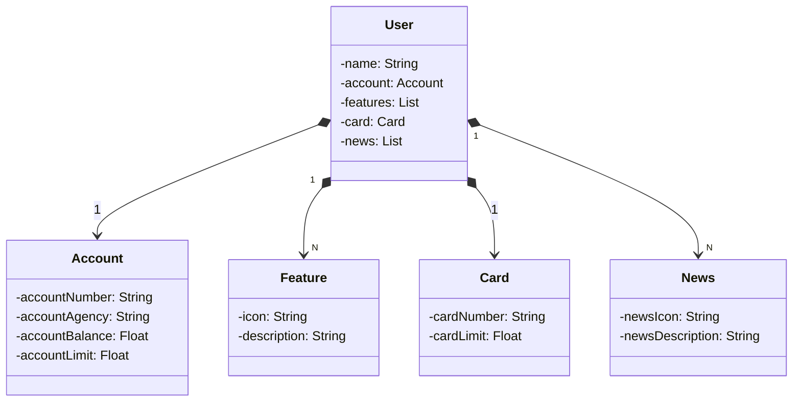

# bootcamp-santander-api-restful
Java RESTful API criado como parte de um desafio de projeto da Digital Innovation One (DIO).

## Diagrama de Classes 

```mermaid
classDiagram
  class User {
    -name: String
    -account: Account
    -features: List<Feature>
    -card: Card
    -news: List<News>
  }

  class Account {
    -accountNumber: String
    -accountAgency: String
    -accountBalance: Float
    -accountLimit: Float
  }

  class Feature {
    -icon: String
    -description: String
  }

  class Card {
    -cardNumber: String
    -cardLimit: Float
  }

  class News {
    -newsIcon: String
    -newsDescription: String
  }

  User *--> Account : 1
  User "1" *--> "N" Feature 
  User *--> Card : 1
  User "1" *--> "N" News 

```
